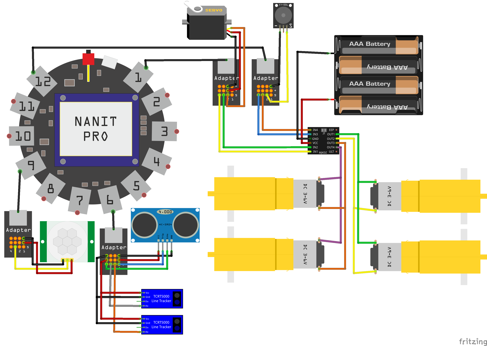

# GroundDrone

[Читай мене Українською](README_uk.md)

Connection Diagram
------------------

Connection Table
--------------------------------------------------------------------------------------
| Sensor          | Connection Port | Arduino Pins              | **Nanit** Pins                   | Note                    |
|:----------------|:----------------|:--------------------------:|:--------------------------------:|:------------------------|
| Motors          | `1` and `12`    |                            |                                  |                         |
| Light Sensor    | `1`             | _A7_                       | __P1_1__                         | Analog signal           |
| Servo           | `1`             | _A6_                       | __P1_2__                         | Digital output          |
| RGB LED         | `4`             | (RGB) _44_, _45_, _46_     | (RGB) __P4_2__, __P4_3__, __P4_4__ | PWM                     |
| Ultrasonic      | `6`             | _23_ (TRIG), _22_ (ECHO)   | __P6_1__ (TRIG), __P6_4__ (ECHO) |                         |
| Line Sensors    | `6`             | _A14_, _A13_               | __P6_2__, __P6_3__               |                         |
| Motion Sensor   | `9`             | _19_                       | __P9_3__                         | Interrupt               |
| Buzzer          | `12`            | _34_                       | __P12_2__                        |                         |
| Driver Enable   | `12`            | _34_                       | __P12_2__                        |                         |

### Additional Information

To power four motors, use an external power source and an external motor driver  
(the built-in battery protection triggers under high discharge current).  

The built-in driver can handle two motors with a light load.  

An alternative solution is not to power Nanit from the internal battery,  
but to supply power through ports that are directly connected to the internal battery  
(`1`, `2`, `11`, `12`).

Behavior
--------

#### Activation

    Both line sensors must be covered simultaneously.

#### Activity

    The robot starts moving and avoids obstacles.
