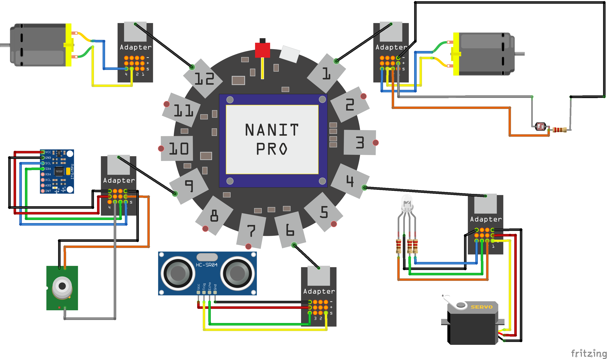

# TankBot

<!-- 2 rgb
сервомотор
датчик руху
датчик лінії
ультрасонік
двигун ПС
датчик газу
датчик температури
гіроскоп та акселеметр
фоторезистор -->
Схема підключення
-------------------------

Таблиця підключення
--------------------------------------------------------------------------------------
|Датчик        |Порт підклюення|піни Arduino   |Піни **Nanit**     |Примітка         |
|:----:        |:--------------|:-------------:|------------------:|-                |
|Мотори        |`1` та `12`    |               |                   |                 |
|Датчик світла |`1`            |_A6_           |__P1_2__           |Аналоговий сигнал|
|Серво         |`1`            |_A7_           |__P1_1__           |Цифровий вихід   |
|RGB-світлодіод|`4`            |(RGB)_44_,_45_,_46_|(RGB)__P4_2__,__P4_3__,__P4_4__|ШИМ|
|Ультрасонік   |`6`            |_23_(TRIG),_22_(ECHO)|__P6_1__(TRIG),__P6_4__(ECHO)| |
|Даьчики ліній |`6`            |_A14_,_A13_    |__P6_2__,__P6_3__  |                 |
|Датчик руху   |`9`            |_19_           |__P9_3__           |Переривання      |
|Гіроскоп      |`9`            |`SDA`(_20_),`SСL`(_21_)|`SDA`(__P9_2__),`SСL`(__P9_1__)||
|Bazzer        |`9`            |_10_           |__P9_4__           |                 |
|DHT 11        |`12`           |_36_           |__P12_1__          |                 |
|Вмикати драйвер|`12`          |_34_           |__P12_2__          |                 |

### Додаткова інформація
Для живлення чотирьох моторів використовувати зовнішнє джерело живлення та зовнішній драйвер двигунів(спрацьовує вбудований захист батареї по струму розряду). 

Вбудований драйвер може обертати два двигуни з невеликим навантаженням

Альетнативне рішення - не живити Наніт від вбудованого акумулятора, а подати живлення через порти в яких є підключення безросереднє підключення до вбудованої батареї (`1`, `2`, `11`, `12`)

Поведінка
---------

#### Активація

    обидва датчики лінії мають одночасно бути закритими

#### Активність

    машинка починає їхати обїзджаючи перешкоди
